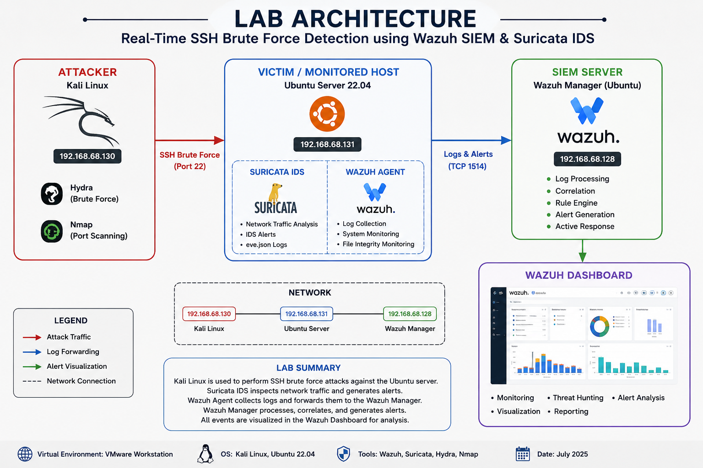
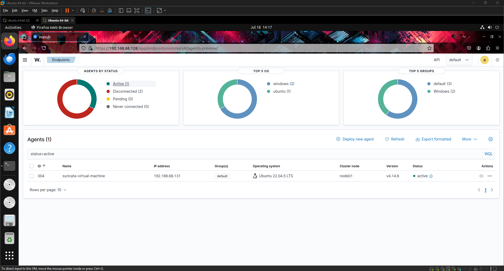
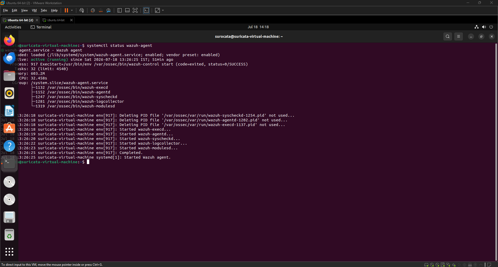
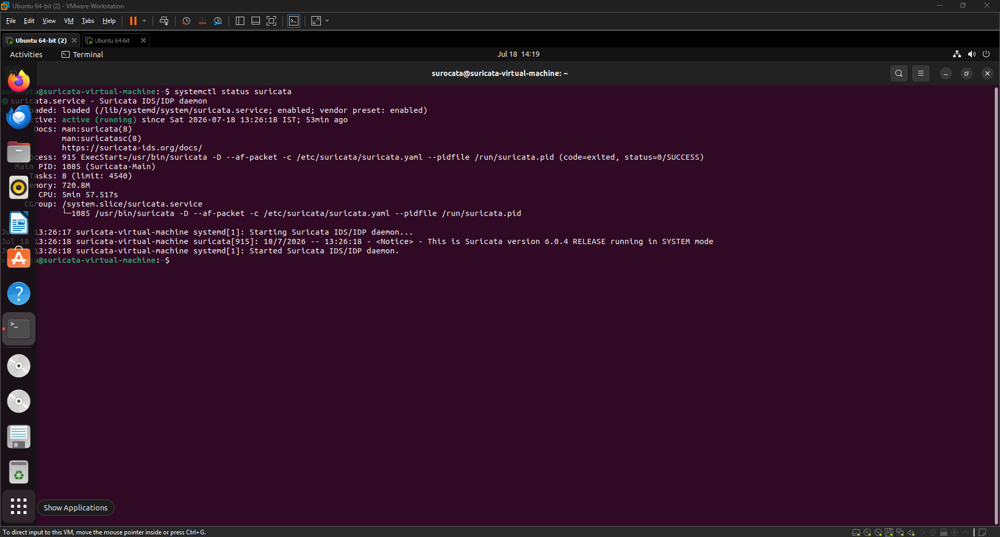
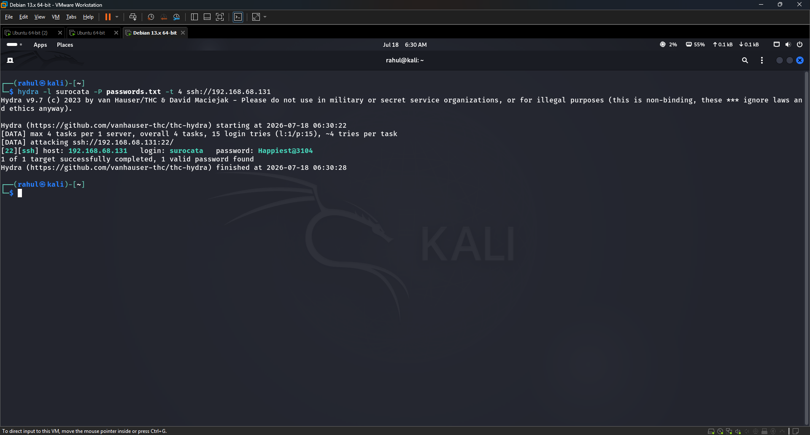
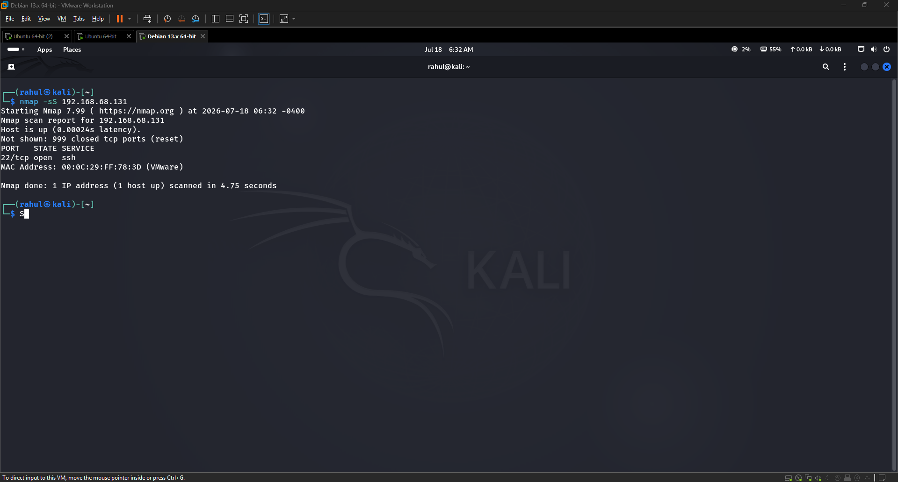
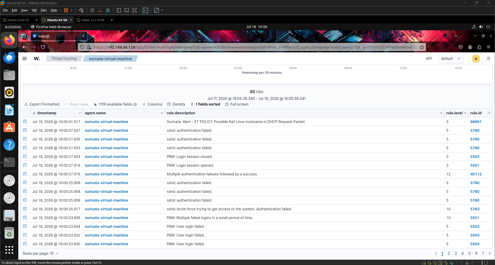
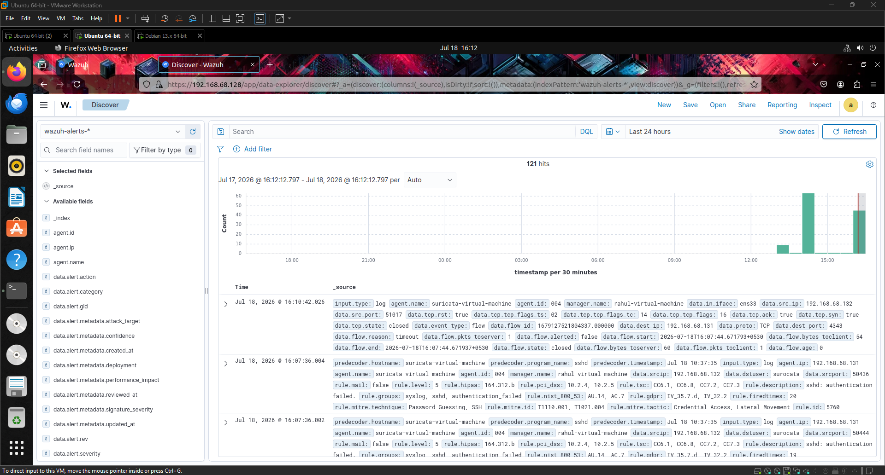
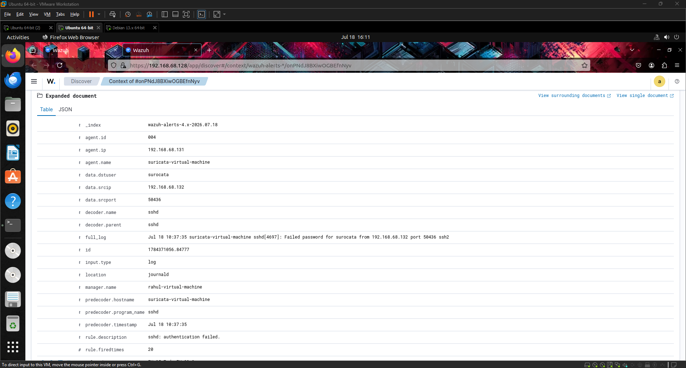

# wazuh-suricata-ssh-bruteforce-detection
SOC Home Lab Project demonstrating SSH brute-force detection using Wazuh SIEM, Suricata IDS, Kali Linux, and Ubuntu Server.
# 🛡️ Real-Time SSH Brute Force Detection using Wazuh SIEM & Suricata IDS


---

# 📌 Project Overview

This project demonstrates a complete SOC Level 1 incident investigation by simulating an SSH brute-force attack using Hydra from Kali Linux against an Ubuntu Server monitored by Wazuh SIEM and Suricata IDS.

The goal of this project is to demonstrate real-world SOC analyst skills including:

- SIEM Monitoring
- Threat Hunting
- Log Analysis
- Incident Investigation
- MITRE ATT&CK Mapping
- IDS Monitoring
- Linux Security Analysis

---

# 🏗️ Lab Architecture

```
                 +----------------+
                 |   Kali Linux   |
                 |  (Attacker)    |
                 +-------+--------+
                         |
                SSH Brute Force
                  Hydra / Nmap
                         |
                         ▼
              +----------------------+
              | Ubuntu Server        |
              | Suricata IDS         |
              | Wazuh Agent          |
              +----------+-----------+
                         |
                  Security Events
                         |
                         ▼
              +----------------------+
              |    Wazuh Server      |
              | SIEM Dashboard       |
              +----------+-----------+
                         |
                  Threat Hunting
                  Alert Analysis
```

---

# 💻 Lab Environment

| Component | Details |
|-----------|----------|
| SIEM | Wazuh |
| IDS | Suricata |
| Attacker | Kali Linux |
| Victim | Ubuntu Server |
| Attack Tool | Hydra |
| Enumeration | Nmap |
| Operating System | Ubuntu 22.04 |

---

# 🎯 Objective

The objective of this project was to simulate an attacker attempting to gain unauthorized SSH access while monitoring and investigating the attack inside Wazuh SIEM.

---

# 🔥 Attack Simulation

## Step 1 — Verify Connectivity

```bash
ping 192.168.68.131
```

Result

```
Host is reachable
```

---

## Step 2 — Scan Target

```bash
nmap -sS 192.168.68.131
```

Result

```
22/tcp open ssh
```

---

## Step 3 — Create Password List

```bash
nano passwords.txt
```

Example

```
admin
root
password
123456
Happiest@3104
```

---

## Step 4 — Launch Hydra Attack

```bash
hydra -l surocata -P passwords.txt -t 4 ssh://192.168.68.131
```

Hydra attempted multiple SSH logins against the Ubuntu server.

---

# 🚨 Detection

The attack generated multiple alerts inside Wazuh.

Alerts observed include:

- SSH Authentication Failure
- Invalid User Login
- PAM Login Failure
- Multiple Failed Login Attempts
- Brute Force Detection

---

# 🔎 Threat Hunting

Inside Wazuh Dashboard

Navigate to

```
Threat Hunting
```

Search

```
agent.name:"suricata-virtual-machine"
```

or

```
rule.groups:sshd
```

Observed Events

- Failed Login
- Invalid Username
- SSH Authentication Failure
- PAM Authentication Failure

---

# 📊 Investigation Process

## Alert Summary

| Alert | Severity |
|---------|----------|
| Invalid User | Medium |
| Failed SSH Login | Medium |
| PAM Authentication Failure | High |
| Multiple Login Attempts | High |

---

## Indicators of Compromise (IOC)

Source IP

```
192.168.68.xxx
```

Target Service

```
SSH
```

Destination Port

```
22
```

Attack Tool

```
Hydra
```

Technique

```
Password Brute Force
```

---

# 🛡️ MITRE ATT&CK Mapping

| Technique | ATT&CK ID |
|------------|-----------|
| Brute Force | T1110 |
| Valid Accounts | T1078 |
| Remote Services | T1021 |

---

# 🧠 SOC Analyst Investigation Workflow

✅ Alert Received

↓

Validate Source IP

↓

Check Target Host

↓

Review SSH Logs

↓

Count Failed Logins

↓

Determine Severity

↓

Identify Attack Pattern

↓

Recommend Blocking Source IP

↓

Close Incident

---

# 📷 Screenshots

## 🏗️ Lab Architecture



---

## 📊 Wazuh Dashboard



---

## 🔐 Connected Agents



---

## 🛡️ Suricata Running



---

## 🚨 Hydra SSH Attack



---

## 🌐 Nmap Scan



---

## 🎯 Threat Hunting



---

## 🚨 SSH Alert



---

## 📋 Alert Details


```
```
``` ```

# 🎯 Skills Demonstrated

- Security Information and Event Management (SIEM)
- Wazuh Administration
- Suricata IDS
- Threat Hunting
- Incident Investigation
- SSH Security Monitoring
- Linux Administration
- Log Analysis
- MITRE ATT&CK
- Network Security
- Hydra
- Nmap

---

# 📚 Tools Used

- Wazuh
- Suricata
- Kali Linux
- Ubuntu Server
- Hydra
- Nmap
- VMware Workstation

---

# 👨‍💻 Author

**Rahul Saware**

SOC Analyst | Cybersecurity Enthusiast

GitHub:
[https://github.com/sawarerahul2-dev](https://github.com/sawarerahul2-dev/wazuh-suricata-ssh-bruteforce-detection/blob/main/README.md)

---

⭐ If you found this project useful, please consider giving it a Star.
